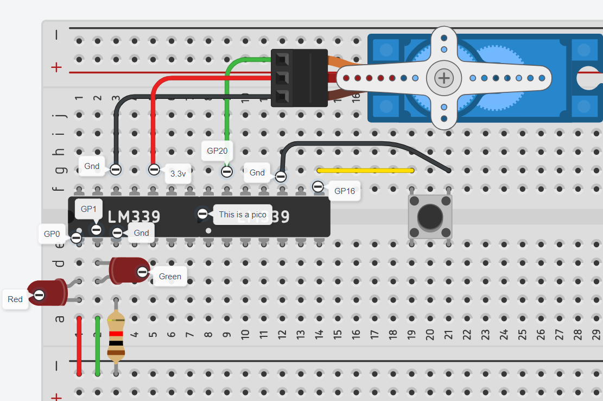

# Engineering_4_Notebook

&nbsp;

## Table of Contents
* [Launch_1-Countdown](#launch_1-countdown)
* [Launch_2-Lights](#launch_2-lights)
* [Launch_3-Button](#launch_3-button)
* [Launch_4-Servo](#launch_4-servo)
* [Crash_Avoidence-Accelerometer](#crash_avoidence-accelerometer)
* [Crash_Avoidence-Lights&Power](#crash_avoidence-lightspower)
* [Crash_Avoidence-OLED](#crash_avoidence-oled)
* [FEA_Part1](#fea_part1)

&nbsp;

## Launch_1-Countdown

### Assignment Description

The purpose of this assingment is to create a countdown from 10 to 0 using a for loop. 

### Evidence 


### Wiring

No wiring for this assignment

### Code

``` python
from time import sleep               #imports sleep

for x in range (10,0,-1):            #count down from ten to zero by -1s
    print (x)                        #print the value
    sleep(1)
print ('Liftoff!')                   #after countdown is done, print liftoff
```

### Reflection

This assignment was fairly basic. There are many different ways to do it, but the way I settled on was the fastest way just using a for loop but setting the bounds and the interval after declaring it. I learned that there is always a faster, more compact way to write code and try to figure it out as opposed to the long way.


## Launch_2-Lights

### Assignment Description

The purpose of this assingment is to create a countdown from 10 to 0 turning on the red light for every second counting down, then turning on the green light upon completion  

### Evidence 


### Wiring


### Code

``` python
import digitalio
import board
from time import sleep                          #importing libs

Rled = digitalio.DigitalInOut(board.GP0)
Rled.direction = digitalio.Direction.OUTPUT     #declaring red led as an output in pin 0

Gled = digitalio.DigitalInOut(board.GP1)
Gled.direction = digitalio.Direction.OUTPUT     #declaring green led as an output in pin 1

for x in range (10,0,-1):                       #count down from ten to zero by -1s
    print (x)                                   #printing value
    Rled.value = True                           #turing red led on
    sleep(.5)                                   #light on for half a second
    Rled.value = False                          #turing red led off
    sleep(.5)                                   #completing the second
print ('Liftoff!')                              #after countdown is done, print liftoff
Gled.value = True                               #turing green led on
sleep(3)

```

### Reflection

For this assignment we just had to turn on lights along with the coundown. The trickiest part was figruing out how long to sleep and when to turn on the lights. I split it up .5 and .5 so it is still a full second but the red light only comes on for half a second. I also remembered that once the script ends everything turns off so the green light doesn't stay on forever. To counter this I just put a sleep at the end. 


## Launch_3-Button

### Assignment Description

The purpose of this assingment is to initiate a countdown from 10 to 0 using a button with a blinking red light for each second and a static green light once the countdown is finished. 

### Evidence 


### Wiring


### Code

``` python
#type: ignore
import digitalio
import board
from time import sleep                          #importing libs

Rled = digitalio.DigitalInOut(board.GP0)
Rled.direction = digitalio.Direction.OUTPUT     #declaring red led as an output in pin 0

Gled = digitalio.DigitalInOut(board.GP1)
Gled.direction = digitalio.Direction.OUTPUT     #declaring green led as an output in pin 1

button = digitalio.DigitalInOut(board.GP16)
button.direction = digitalio.Direction.INPUT     #declaring button as an input in pin 16
button.pull = digitalio.Pull.UP                  #making the button a pull down

while True:
    if button.value == False:                           #if the button is pressed, do:
        for x in range (10,0,-1):                       #count down from ten to zero by -1s
            print (x)                                   #printing value
            Rled.value = True                           #turing red led on
            sleep(.5)                                   #light on for half a second
            Rled.value = False                          #turing red led off
            sleep(.5)                                   #completing the second
        print ('Liftoff!')                              #after countdown is done, print liftoff
        Gled.value = True                               #turing green led on
        sleep(3)
        Gled.value = False
```

### Reflection

This assingment was confusing at first becuase I forgot how button pullups and pulldowns worked. Once I fully read Mr. Miller's assignment I was able to understand why my button wasn't working. Becuase it was connected to ground and not power, it needed to be a pullup and the if loop condition should have been False with two equal signs. 


## Launch_4-Servo

### Assignment Description

The purpose of this assingment is to initiate a countdown from 10 to 0 using a button with a blinking red light for each second and then activate both a static green light and 180 servo once the countdown is finished. 

### Evidence 


### Wiring



### Code

``` python
#type: ignore
import pwmio
from adafruit_motor import servo
import digitalio
import board
from time import sleep                                                      #importing libs

Rled = digitalio.DigitalInOut(board.GP0)
Rled.direction = digitalio.Direction.OUTPUT                                 #declaring red led as an output in pin 0

Gled = digitalio.DigitalInOut(board.GP1)
Gled.direction = digitalio.Direction.OUTPUT                                 #declaring green led as an output in pin 1

button = digitalio.DigitalInOut(board.GP16)
button.direction = digitalio.Direction.INPUT                                #declaring button as an input in pin 16
button.pull = digitalio.Pull.UP                                             #making the button a pull down

pwm_servo = pwmio.PWMOut(board.GP20, duty_cycle=2 ** 15, frequency=50)      #tells pin 20 it will control a servo
servo1 = servo.Servo(pwm_servo, min_pulse=500, max_pulse=2500)              #setting buonds for servo


while True:
    if button.value == False:                           #if the button is pressed, do:
        for x in range (10,0,-1):                       #count down from ten to zero by -1s
            print (x)                                   #printing value
            Rled.value = True                           #this function turns an led on or off
            sleep(.5)                                   #light on for just half a second
            Rled.value = False                         
            sleep(.5)                                   #completing the second for the loop
        print ('Liftoff!')                              #after countdown is done, print liftoff
        Gled.value = True                               
        servo1.angle = 180                              #turn the servo 180 degrees
        sleep(3)
        servo1.angle = 0                                #reset servo
        Gled.value = False                      
```

### Reflection

This assignment was easy because all I had to do was follow instructions. The hardest part was understanding how the servo libaries should be referenced and what all the things inside the parenthesis mean. When defining a servo you need to define two things: the actual variable you are going to use in your loops and the output from the Pico pin that you will need to use to define the real variable. 


## Crash_Avoidence-Accelerometer 

### Assignment Description

The purpose of this assingment was to hook up an accelerometer to the pico and print the values into the terminal. 

### Evidence 


### Wiring


### Code

``` python
#type: ignore
import adafruit_mpu6050
import  busio
import board
from time import sleep                #imports required libraries 

sda_pin = board.GP14                  #defining sda pin
scl_pin = board.GP15                  #defining the scl pin
i2c = busio.I2C(scl_pin, sda_pin)     #creating the i2c from the pins
mpu = adafruit_mpu6050.MPU6050(i2c)   #putting them all together to make the accelerometer 

while True:
    print("x:", mpu.acceleration[0])
    print("y:", mpu.acceleration[1])
    print("z:", mpu.acceleration[2])  #printing respective x, y, and z values
    print("")                         #printing new line
    sleep(1)                          #sleep for 1 second 
```

### Reflection

This assingment was not challenging. Once the new libraries were imported, all I had to do was use them in my code. I used the example code from the assingment to use the values provided by the accelerometer. I then infered that because the x value recorded by the accelerometer was mpu.acceleration[0], the y would be [1] and the z [2]. I didn't know if there was a better way to create a new line inbetween sets of printing, but google didn't show anything easy so I just used an empty print line. 


## Crash_Avoidence-Lights&Power 

### Assignment Description

The purpose of this assingment was to turn on an LED if the accelerometer was rotated outside a certain range.

### Evidence 


### Wiring


### Code

``` python
#type: ignore
import digitalio
import adafruit_mpu6050
import  busio
import board
from time import sleep                      #imports required libraries 


led = digitalio.DigitalInOut(board.GP0)     #telling the pico that there is something on pin 0
led.direction = digitalio.Direction.OUTPUT  #declaring  led as an output in pin 0
sda_pin = board.GP14                        #defining sda pin
scl_pin = board.GP15                        #defining the scl pin
i2c = busio.I2C(scl_pin, sda_pin)           #creating the i2c from the pins
mpu = adafruit_mpu6050.MPU6050(i2c)         #putting them all together to make the accelerometer 

while True:
    print("x:", mpu.acceleration[0])
    print("y:", mpu.acceleration[1])
    print("z:", mpu.acceleration[2])        #printing respective x, y, and z values
    print("")                               #printing new line
    sleep(.2)                               #sleep for .2 seconds 
    if abs(mpu.acceleration[0]) > 8.5 or abs(mpu.acceleration[1]) > 8.5:  #if accelerometer rotates out of range do:
        print("uh oh")                
        led.value = True                    #turns led on
    else:                                                                 #if accelerometer is in range do:
        led.value = False                   #turns led off
```

### Reflection

This assingment was a bit more complicated than the last one. I hooked up the LED in the same way I did in the first assingment and copied that code over. Then I hooked up a second breadboard to create space and put the battery on that breadboard. You have to be careful when connecting the pins for the battery to the right pins in the pico and double check your work because I saw other people in my class fry their pico. I learned that you could use abs() to take the absolute value of an input so I could tidy up my loop requirements.


## Crash_Avoidence-OLED 

### Assignment Description

The purpose of this assingment was to turn on an LED if the accelerometer was rotated outside a certain range and then print the x, y, and z angular velocities on an OLED screen. 

### Evidence 


### Wiring


### Code

``` python
#type: ignore
from adafruit_display_text import label
import adafruit_displayio_ssd1306
import terminalio
import displayio
import digitalio
import adafruit_mpu6050
import  busio
import board
from time import sleep                                                         #imports required libraries 

displayio.release_displays()

led = digitalio.DigitalInOut(board.GP0)                                        #telling the pico that there is something on pin 0
led.direction = digitalio.Direction.OUTPUT                                     #declaring  led as an output in pin 0

sda_pin = board.GP14                                                           #defining sda pin
scl_pin = board.GP15                                                           #defining the scl pin
i2c = busio.I2C(scl_pin, sda_pin)                                              #creating the i2c from the pins
mpu = adafruit_mpu6050.MPU6050(i2c, address=0x68)                              #declaring the accerlerometer in this address

display_bus = displayio.I2CDisplay(i2c, device_address=0x3d, reset=board.GP20) #declaring the OLED in this address 
display = adafruit_displayio_ssd1306.SSD1306(display_bus, width=128, height=64)
splash = displayio.Group()
title = "ANGULAR VELOCITY"
text_area = label.Label(terminalio.FONT, text=title, color=0xFFFF00, x=5, y=5)
splash.append(text_area)    
display.show(splash)                                                            #setting up the OLED

newline = ord('\n')

while True:
    print("x:", mpu.gyro[0])
    print("y:", mpu.gyro[1])
    print("z:", mpu.gyro[2])        #printing respective x, y, and z values
    print("")                       #printing new line
    sleep(.2)                       #sleep for .2 seconds 
    text_area.text = f"{title}: \n X:{round(mpu.gyro[0],3)} \n Y:{round(mpu.gyro[1],3)} \n Z:{round(mpu.gyro[2],3)}" #print the x, y, and z values on the OLED
    if abs(mpu.acceleration[0]) > 8.5 or abs(mpu.acceleration[1]) > 8.5 or mpu.acceleration[2] < 0:                  #if accelerometer rotates out of range do:
        print("uh oh")                
        led.value = True             #turns led on
        text_area.text = f"Rotation: \n X:{round(mpu.gyro[0],3)} \n Y:{round(mpu.gyro[1],3)} \n Z:{round(mpu.gyro[2],3)}"
    else:                            #if accelerometer is in range do:
        led.value = False            #turns led off
```

### Reflection

This assingment was very tricky. It introduced an OLED which has a lot of setup and specific syntax. We also had to use code to find the address of the two i2cs and then use the same SDA/SCL pins for them. I had to learn how to do f strings and the syntax for those. these: {} are used for print variables defined before in the code or inputs

&nbsp;

## FEA_Part1

### Assignment Description

We had to create a beam that was less than or equal to 13 grams and able to hold as much weight as possible.

### Onshape Link

[Onshape](https://cvilleschools.onshape.com/documents/24b88ffe9264a0c98a74dc0e/w/222f8de2303c65f5e9c59127/e/16bf75dd5e63ea4c1d80e02d).

### Part Image


### Reflection

This project made me and Vinnie learn to work as a team together. we both have good ideas and it is hard to choose the best one sometimes it leads to arguments but in the end, we prevailed and came up with a great design that will hopefully hold up lots of weight (more than just the bucket). Our design includes triangles and kites which all allowed us to not implement overhangs into our design. I also relearned lots of things in CAD such as what the chamfer tool does and just some basics that I hadn't used in 4 months. We used variables and design intent to make editing the beam easier.

&nbsp;

## Media Test

### Test Link
[Google](https://en.wikipedia.org/wiki/Minions:_The_Rise_of_Gru?scrlybrkr=e146fde2)      
### Test Image

### Test GIF

