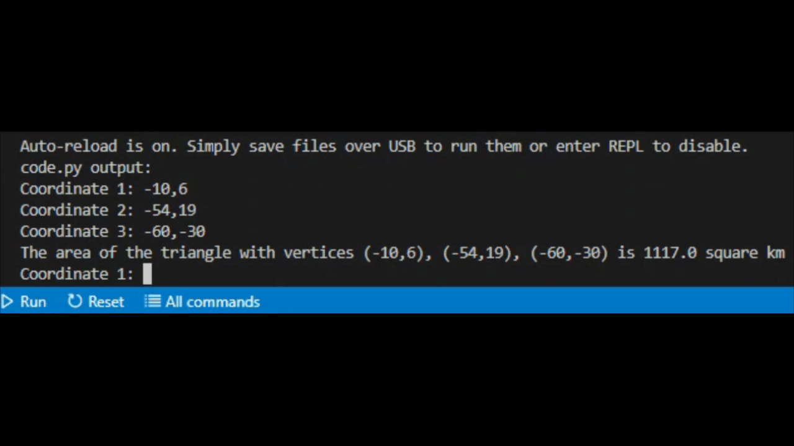
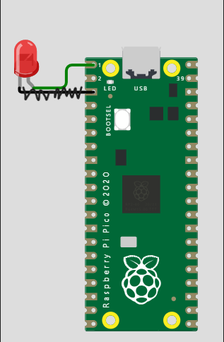

# Engineering_4_Notebook

&nbsp;

## Table of Contents
* [Launch_1-Countdown](#launch_1-countdown)
* [Launch_2-Lights](#launch_2-lights)
* [Launch_3-Button](#launch_3-button)
* [Launch_4-Servo](#launch_4-servo)
* [Crash_Avoidence-Accelerometer](#crash_avoidence-accelerometer)
* [Crash_Avoidence-Lights&Power](#crash_avoidence-lightspower)
* [Crash_Avoidence-OLED](#crash_avoidence-oled)
* [FEA_Part1](#fea_part1)
* [FEA_Part2](#fea_part3)
* [FEA_Part4](#fea_part4) 
* [Landing_Pad1](#landing_pad1)
* [Landing_Pad2](#landing_pad2) 
* [Morse_Code1](#morse_code1) 
* [Morse_Code2](#morse_code2)
* [Data_Collection](#data_collection)

&nbsp;

## Launch_1-Countdown

### Assignment Description

The purpose of this assingment is to create a countdown from 10 to 0 using a for loop. 

### Evidence 


### Wiring

No wiring for this assignment

### Code

``` python
from time import sleep               #imports sleep

for x in range (10,0,-1):            #count down from ten to zero by -1s
    print (x)                        #print the value
    sleep(1)
print ('Liftoff!')                   #after countdown is done, print liftoff
```

### Reflection

This assignment was fairly basic. There are many different ways to do it, but the way I settled on was the fastest way just using a for loop but setting the bounds and the interval after declaring it. I learned that there is always a faster, more compact way to write code and try to figure it out as opposed to the long way.


## Launch_2-Lights

### Assignment Description

The purpose of this assingment is to create a countdown from 10 to 0 turning on the red light for every second counting down, then turning on the green light upon completion  

### Evidence 


### Wiring


### Code

``` python
import digitalio
import board
from time import sleep                          #importing libs

Rled = digitalio.DigitalInOut(board.GP0)
Rled.direction = digitalio.Direction.OUTPUT     #declaring red led as an output in pin 0

Gled = digitalio.DigitalInOut(board.GP1)
Gled.direction = digitalio.Direction.OUTPUT     #declaring green led as an output in pin 1

for x in range (10,0,-1):                       #count down from ten to zero by -1s
    print (x)                                   #printing value
    Rled.value = True                           #turing red led on
    sleep(.5)                                   #light on for half a second
    Rled.value = False                          #turing red led off
    sleep(.5)                                   #completing the second
print ('Liftoff!')                              #after countdown is done, print liftoff
Gled.value = True                               #turing green led on
sleep(3)

```

### Reflection

For this assignment we just had to turn on lights along with the coundown. The trickiest part was figruing out how long to sleep and when to turn on the lights. I split it up .5 and .5 so it is still a full second but the red light only comes on for half a second. I also remembered that once the script ends everything turns off so the green light doesn't stay on forever. To counter this I just put a sleep at the end. 


## Launch_3-Button

### Assignment Description

The purpose of this assingment is to initiate a countdown from 10 to 0 using a button with a blinking red light for each second and a static green light once the countdown is finished. 

### Evidence 


### Wiring


### Code

``` python
#type: ignore
import digitalio
import board
from time import sleep                          #importing libs

Rled = digitalio.DigitalInOut(board.GP0)
Rled.direction = digitalio.Direction.OUTPUT     #declaring red led as an output in pin 0

Gled = digitalio.DigitalInOut(board.GP1)
Gled.direction = digitalio.Direction.OUTPUT     #declaring green led as an output in pin 1

button = digitalio.DigitalInOut(board.GP16)
button.direction = digitalio.Direction.INPUT     #declaring button as an input in pin 16
button.pull = digitalio.Pull.UP                  #making the button a pull down

while True:
    if button.value == False:                           #if the button is pressed, do:
        for x in range (10,0,-1):                       #count down from ten to zero by -1s
            print (x)                                   #printing value
            Rled.value = True                           #turing red led on
            sleep(.5)                                   #light on for half a second
            Rled.value = False                          #turing red led off
            sleep(.5)                                   #completing the second
        print ('Liftoff!')                              #after countdown is done, print liftoff
        Gled.value = True                               #turing green led on
        sleep(3)
        Gled.value = False
```

### Reflection

This assingment was confusing at first becuase I forgot how button pullups and pulldowns worked. Once I fully read Mr. Miller's assignment I was able to understand why my button wasn't working. Becuase it was connected to ground and not power, it needed to be a pullup and the if loop condition should have been False with two equal signs. 


## Launch_4-Servo

### Assignment Description

The purpose of this assingment is to initiate a countdown from 10 to 0 using a button with a blinking red light for each second and then activate both a static green light and 180 servo once the countdown is finished. 

### Evidence 


### Wiring


### Code

``` python
#type: ignore
import pwmio
from adafruit_motor import servo
import digitalio
import board
from time import sleep                                                      #importing libs

Rled = digitalio.DigitalInOut(board.GP0)
Rled.direction = digitalio.Direction.OUTPUT                                 #declaring red led as an output in pin 0

Gled = digitalio.DigitalInOut(board.GP1)
Gled.direction = digitalio.Direction.OUTPUT                                 #declaring green led as an output in pin 1

button = digitalio.DigitalInOut(board.GP16)
button.direction = digitalio.Direction.INPUT                                #declaring button as an input in pin 16
button.pull = digitalio.Pull.UP                                             #making the button a pull down

pwm_servo = pwmio.PWMOut(board.GP20, duty_cycle=2 ** 15, frequency=50)      #tells pin 20 it will control a servo
servo1 = servo.Servo(pwm_servo, min_pulse=500, max_pulse=2500)              #setting buonds for servo


while True:
    if button.value == False:                           #if the button is pressed, do:
        for x in range (10,0,-1):                       #count down from ten to zero by -1s
            print (x)                                   #printing value
            Rled.value = True                           #this function turns an led on or off
            sleep(.5)                                   #light on for just half a second
            Rled.value = False                         
            sleep(.5)                                   #completing the second for the loop
        print ('Liftoff!')                              #after countdown is done, print liftoff
        Gled.value = True                               
        servo1.angle = 180                              #turn the servo 180 degrees
        sleep(3)
        servo1.angle = 0                                #reset servo
        Gled.value = False                      
```

### Reflection

This assignment was easy because all I had to do was follow instructions. The hardest part was understanding how the servo libaries should be referenced and what all the things inside the parenthesis mean. When defining a servo you need to define two things: the actual variable you are going to use in your loops and the output from the Pico pin that you will need to use to define the real variable. 


## Crash_Avoidence-Accelerometer 

### Assignment Description

The purpose of this assingment was to hook up an accelerometer to the pico and print the values into the terminal. 

### Evidence 


### Wiring


### Code

``` python
#type: ignore
import adafruit_mpu6050
import  busio
import board
from time import sleep                #imports required libraries 

sda_pin = board.GP14                  #defining sda pin
scl_pin = board.GP15                  #defining the scl pin
i2c = busio.I2C(scl_pin, sda_pin)     #creating the i2c from the pins
mpu = adafruit_mpu6050.MPU6050(i2c)   #putting them all together to make the accelerometer 

while True:
    print("x:", mpu.acceleration[0])
    print("y:", mpu.acceleration[1])
    print("z:", mpu.acceleration[2])  #printing respective x, y, and z values
    print("")                         #printing new line
    sleep(1)                          #sleep for 1 second 
```

### Reflection

This assingment was not challenging. Once the new libraries were imported, all I had to do was use them in my code. I used the example code from the assingment to use the values provided by the accelerometer. I then infered that because the x value recorded by the accelerometer was mpu.acceleration[0], the y would be [1] and the z [2]. I didn't know if there was a better way to create a new line inbetween sets of printing, but google didn't show anything easy so I just used an empty print line. 


## Crash_Avoidence-Lights&Power 

### Assignment Description

The purpose of this assingment was to turn on an LED if the accelerometer was rotated outside a certain range.

### Evidence 


### Wiring


### Code

``` python
#type: ignore
import digitalio
import adafruit_mpu6050
import  busio
import board
from time import sleep                      #imports required libraries 


led = digitalio.DigitalInOut(board.GP0)     #telling the pico that there is something on pin 0
led.direction = digitalio.Direction.OUTPUT  #declaring  led as an output in pin 0
sda_pin = board.GP14                        #defining sda pin
scl_pin = board.GP15                        #defining the scl pin
i2c = busio.I2C(scl_pin, sda_pin)           #creating the i2c from the pins
mpu = adafruit_mpu6050.MPU6050(i2c)         #putting them all together to make the accelerometer 

while True:
    print("x:", mpu.acceleration[0])
    print("y:", mpu.acceleration[1])
    print("z:", mpu.acceleration[2])        #printing respective x, y, and z values
    print("")                               #printing new line
    sleep(.2)                               #sleep for .2 seconds 
    if abs(mpu.acceleration[0]) > 8.5 or abs(mpu.acceleration[1]) > 8.5:  #if accelerometer rotates out of range do:
        print("uh oh")                
        led.value = True                    #turns led on
    else:                                                                 #if accelerometer is in range do:
        led.value = False                   #turns led off
```

### Reflection

This assingment was a bit more complicated than the last one. I hooked up the LED in the same way I did in the first assingment and copied that code over. Then I hooked up a second breadboard to create space and put the battery on that breadboard. You have to be careful when connecting the pins for the battery to the right pins in the pico and double check your work because I saw other people in my class fry their pico. I learned that you could use abs() to take the absolute value of an input so I could tidy up my loop requirements.


## Crash_Avoidence-OLED 

### Assignment Description

The purpose of this assingment was to turn on an LED if the accelerometer was rotated outside a certain range and then print the x, y, and z angular velocities on an OLED screen. 

### Evidence 


### Wiring


### Code

``` python
#type: ignore
from adafruit_display_text import label
import adafruit_displayio_ssd1306
import terminalio
import displayio
import digitalio
import adafruit_mpu6050
import  busio
import board
from time import sleep                                                         #imports required libraries 

displayio.release_displays()

led = digitalio.DigitalInOut(board.GP0)                                        #telling the pico that there is something on pin 0
led.direction = digitalio.Direction.OUTPUT                                     #declaring  led as an output in pin 0

sda_pin = board.GP14                                                           #defining sda pin
scl_pin = board.GP15                                                           #defining the scl pin
i2c = busio.I2C(scl_pin, sda_pin)                                              #creating the i2c from the pins
mpu = adafruit_mpu6050.MPU6050(i2c, address=0x68)                              #declaring the accerlerometer in this address

display_bus = displayio.I2CDisplay(i2c, device_address=0x3d, reset=board.GP20) #declaring the OLED in this address 
display = adafruit_displayio_ssd1306.SSD1306(display_bus, width=128, height=64)
splash = displayio.Group()
title = "ANGULAR VELOCITY"
text_area = label.Label(terminalio.FONT, text=title, color=0xFFFF00, x=5, y=5)
splash.append(text_area)    
display.show(splash)                                                            #setting up the OLED

newline = ord('\n')

while True:
    print("x:", mpu.gyro[0])
    print("y:", mpu.gyro[1])
    print("z:", mpu.gyro[2])        #printing respective x, y, and z values
    print("")                       #printing new line
    sleep(.2)                       #sleep for .2 seconds 
    text_area.text = f"{title}: \n X:{round(mpu.gyro[0],3)} \n Y:{round(mpu.gyro[1],3)} \n Z:{round(mpu.gyro[2],3)}" #print the x, y, and z values on the OLED
    if abs(mpu.acceleration[0]) > 8.5 or abs(mpu.acceleration[1]) > 8.5 or mpu.acceleration[2] < 0:                  #if accelerometer rotates out of range do:
        print("uh oh")                
        led.value = True             #turns led on
        text_area.text = f"Rotation: \n X:{round(mpu.gyro[0],3)} \n Y:{round(mpu.gyro[1],3)} \n Z:{round(mpu.gyro[2],3)}"
    else:                            #if accelerometer is in range do:
        led.value = False            #turns led off
```

### Reflection

This assingment was very tricky. It introduced an OLED which has a lot of setup and specific syntax. We also had to use code to find the address of the two i2cs and then use the same SDA/SCL pins for them. I had to learn how to do f strings and the syntax for those. these: {} are used for print variables defined before in the code or inputs


## Landing_Pad1

### Assignment Description

In this assingment our goal was to make a function that would take 3 (x,y) coordinates as inputs and then calculate the area of the triangle created by those coordinates. 

### Evidence 



### Wiring

No Wiring 

### Code

``` python
#credit to afton for the math and functions portion
#type: ignore

from time import sleep

x = 0
y = 1

def area(r1,r2,r3):
    c1 = [0,0]
    c2 = [0,0]
    c3 = [0,0]
    try:                    # Coordinate 1
        c1 = [int(o) for o in r1.split(",")] # Splits raw string: "1,2" into a string array: "1", "2", and turns each value into an int: 1,2
    except:
        print("Coordinate 1 Invalid, please enter in 'x,y' format")
        pass
    finally:

        try:                # Coordinate 2
            c2 = [int(o) for o in r2.split(",")]
        except:
            print("Coordinate 2 Invalid, please enter in 'x,y' format")
            pass
        finally:

            try:            # Coordinate 3
                c3 = [int(o) for o in r3.split(",")]
            except:
                print("Coordinate 3 Invalid, please enter in 'x,y' format")
                pass
            finally:
                A = (1/2)*abs(c1[x]*(c2[y] - c3[y]) + c2[x]*(c3[y] - c1[y]) + c3[x]*(c1[y] - c2[y])) # Easy plug and play equation for a triangle's area
                return A
while True:
    r1 = input("Coordinate 1: ")                                                                                                                #asking for inputs
    r2 = input("Coordinate 2: ")
    r3 = input("Coordinate 3: ")
    print('The area of the triangle with vertices ('+ str(r1)+ '), ('+ str(r2)+ '), ('+ str(r3)+ ') is '+ str(area(r1,r2,r3)) +' square km')    #returning answer
```

### Reflection

I got to a slow start on this assingment and let quite a few class periods get away from me. Then Afton helped me out by showing me his code for the new syntax for the function we were trying to create. In order to take the input in the (x,y) form, we needed to use rx.split(","). This took research to figure out how to use and many trials and errors. Then in order to print the sentence that Mr. Miller wanted, I needed to remember how to integrate floats into strings and I did that by using the str() and + before and after every integration. 


## Landing_Pad2

### Assignment Description

In this assingment our goal was to make a function that would take 3 (x,y) coordinates as inputs and then display that triangle on an OLED along with still calculating the area. 

### Evidence 


### Wiring


### Code

``` python
#credit to afton for the math and functions portion
#type: ignore

from time import sleep
import adafruit_displayio_ssd1306
import displayio
import board
import busio                                                                   #importing libs for OLED
from adafruit_display_shapes.line import Line
from adafruit_display_shapes.circle import Circle
from adafruit_display_shapes.triangle import Triangle                          #importing tools requied to make shapes on the OLED

x = 0
y = 1

displayio.release_displays()
sda_pin = board.GP14                                                           #defining sda pin
scl_pin = board.GP15                                                           #defining the scl pin
i2c = busio.I2C(scl_pin, sda_pin) 
display_bus = displayio.I2CDisplay(i2c, device_address=0x3d, reset=board.GP20) #declaring the OLED in this address  
display = adafruit_displayio_ssd1306.SSD1306(display_bus, width=128, height=64)
splash = displayio.Group()                                                     #getting OLED ready

c1 = [0,0] #creates coordinates 
c2 = [0,0]
c3 = [0,0]

def area(r1,r2,r3): #area function
    global c1
    global c2
    global c3
    try:                    # Coordinate 1
        c1 = [int(o) for o in r1.split(",")] # Splits raw string: "1,2" into a string array: "1", "2", and turns each value into an int: 1,2
    except:
        print("Coordinate 1 Invalid, please enter in 'x,y' format")
        pass
    finally:

        try:                # Coordinate 2
            c2 = [int(o) for o in r2.split(",")]
        except:
            print("Coordinate 2 Invalid, please enter in 'x,y' format")
            pass
        finally:

            try:            # Coordinate 3
                c3 = [int(o) for o in r3.split(",")]
            except:
                print("Coordinate 3 Invalid, please enter in 'x,y' format")
                pass
            finally:
                A = (1/2)*abs(c1[x]*(c2[y] - c3[y]) + c2[x]*(c3[y] - c1[y]) + c3[x]*(c1[y] - c2[y])) # Easy plug and play equation for a triangle's area
                return A


while True:
    r1 = input("Coordinate 1: ")                                                                                                                #asking for inputs
    r2 = input("Coordinate 2: ")
    r3 = input("Coordinate 3: ")
    print('The area of the triangle with vertices ('+ str(r1)+ '), ('+ str(r2)+ '), ('+ str(r3)+ ') is '+ str(area(r1,r2,r3)) +' square km')    #returning answer

    splash = displayio.Group()
    hline = Line(64,0,64,64, color=0xFFFF00)                                                               #making x, y, and the origin on the OLED graph
    vline = Line(0,32,128,32, color=0xFFFF00)
    circle = Circle(64,32,2, outline=0xFFFF00)
    triangle = Triangle(c1[x]+64,-c1[y]+32,c2[x]+64,-c2[y]+32,c3[x]+64,-c3[y]+32, outline=0xFFFF00)        #displaying the triangle based on input on the OLED graph
    splash.append(hline)
    splash.append(vline)
    splash.append(circle)
    splash.append(triangle)                                                                                #priming shapes and lines
    display.show(splash)                                                                                   #displaying everything on the OLED graph
```

### Reflection

This assignment was tricky because I forgot how the OLED worked. I looked at my other code and wiring to decypher it, but ultimatly nick was a big help understanding how the "splash" worked. After downloading the required libraries, the shapes weren't too complicated, but I did have a problem with the triangle being rotated incorrectly. To fix this I had to make the y inputs negative, then it was oriented correctly. 


## Morse_Code1

### Assignment Description

In this assingment our goal was to make a function that would take user input and then translate it into morse code dots and dashes. If -q is typed, the script will stop.

### Evidence 


### Wiring

No Wiring 

### Code

``` python
#type: ignore
print("Enter morse code message or -q to quit")                         #prompts user
message = ""    
character = 0                                                           #setting values
MORSE_CODE = { 'A':'.-', 'B':'-...',                                    #defining letters 
    'C':'-.-.', 'D':'-..', 'E':'.',
    'F':'..-.', 'G':'--.', 'H':'....',
    'I':'..', 'J':'.---', 'K':'-.-',
    'L':'.-..', 'M':'--', 'N':'-.',
    'O':'---', 'P':'.--.', 'Q':'--.-',
    'R':'.-.', 'S':'...', 'T':'-',
    'U':'..-', 'V':'...-', 'W':'.--',
    'X':'-..-', 'Y':'-.--', 'Z':'--..',
    '1':'.----', '2':'..---', '3':'...--',
    '4':'....-', '5':'.....', '6':'-....',
    '7':'--...', '8':'---..', '9':'----.',
    '0':'-----', ', ':'--..--', '.':'.-.-.-',
    '?':'..--..', '/':'-..-.', '-':'-....-',
    '(':'-.--.', ')':'-.--.-', ' ':'/'}

while True:
    usrInput = input("Your message: ").upper()                           #Takes input from user and capitalizes it
    if "-Q" in usrInput:                                                 #Checks if user would like to exit
        exit()
    try:
        for character in range(len(usrInput)):                           #Iterates through each character of the input text
            message += MORSE_CODE[usrInput[character]] + " "             #Translates and adds a space
    except:
        message = ("Can't translate: " + str({usrInput[character]}))     #Tells you if a character you typed was invalid
    print(message)
    message = ("")                                                       #reset message
```

### Reflection

I got some help from afton understanding the if/try/except loops and then it wasn't too hard from there. The most tricky part was figuring out where to imbed the inputs and variables. I also had another string conflict and had to resolve that by using str() once again. 


## Morse_Code2

### Assignment Description

In this assingment our goal was to make a function that would take user input and then translate it into morse code dots and dashes, while also making an LED blink displaying the message. If -q is typed, the script will stop. 

### Evidence 


### Wiring



### Code

``` python
#type: ignore
import digitalio
import board
from time import sleep                      #imports required libraries 

led = digitalio.DigitalInOut(board.GP0)     #telling the pico that there is something on pin 0
led.direction = digitalio.Direction.OUTPUT  #declaring  led as an output in pin 0

print("Enter morse code message or -q to quit")                         #prompts user
message = ""    
character = 0                                                           #setting values

modifier = 0.25
dot_time = 1*modifier
dash_time = 3*modifier
between_taps = 1*modifier
between_letters = 3*modifier
between_words = 7*modifier                                              #setting timing values

MORSE_CODE = { 'A':'.-', 'B':'-...',                                    #defining letters 
    'C':'-.-.', 'D':'-..', 'E':'.',
    'F':'..-.', 'G':'--.', 'H':'....',
    'I':'..', 'J':'.---', 'K':'-.-',
    'L':'.-..', 'M':'--', 'N':'-.',
    'O':'---', 'P':'.--.', 'Q':'--.-',
    'R':'.-.', 'S':'...', 'T':'-',
    'U':'..-', 'V':'...-', 'W':'.--',
    'X':'-..-', 'Y':'-.--', 'Z':'--..',
    '1':'.----', '2':'..---', '3':'...--',
    '4':'....-', '5':'.....', '6':'-....',
    '7':'--...', '8':'---..', '9':'----.',
    '0':'-----', ', ':'--..--', '.':'.-.-.-',
    '?':'..--..', '/':'-..-.', '-':'-....-',
    '(':'-.--.', ')':'-.--.-', ' ':'/'}

while True:
    usrInput = input("Your message: ").upper()                           #Takes input from user and capitalizes it
    if "-Q" in usrInput:                                                 #Checks if user would like to exit
        exit()
    try:
        for character in range(len(usrInput)):                           #Iterates through each character of the input text
            message += MORSE_CODE[usrInput[character]] + " "             #Translates and adds a space
    except:
        message = ("Can't translate: " + str({usrInput[character]}))     #Tells you if a character you typed was invalid

    print(message)
    for character in message: 
        if character == ".":                                             #if character is a dot, do a short blink
            led.value = True
            sleep(dot_time)
            led.value = False
        if character == "-":                                             #if character is a dash, do a long blink
            led.value = True
            sleep(dash_time)
            led.value = False           
        if character == " ":                                             #if character is between letters, do a “between letters” pause
            sleep(between_letters)
        if character == "/":                                             #if it's between words, do a “between words” pause
            sleep(between_words)
        sleep(between_taps)
    message = ("")                                                       #reset message
```

### Reflection

This assingment was straightforward. After adding all the variables from the assingment, it was a matter of finding which loop to put the pauses within. I used the variables to set the amount of time the pauses lasted instead of typing the values in.


## Data_Collection

### Assignment Description

Collect data from acceleometer and then write it to data.csv. Has to be able to collect data headless and turn on a warning light if it is tilted over 90 degrees. 

### Evidence 


### Wiring


### Data

|Time s|x acceleration|y acceleration|z acceleration|Tilt |
|------|---------|---------|---------|---|
|7.649 |0.550666 |8.71489  |8.81784  |0  |
|8.782 |0.565032 |8.84658  |8.87052  |0  |
|9.912 |0.538695 |8.75799  |8.76278  |0  |
|11.041|0.548272 |8.78672  |8.69335  |0  |
|12.17 |0.52433  |8.7532   |8.61434  |0  |
|13.297|10.7763  |2.59771  |2.39899  |1  |
|14.433|-4.75967 |10.4531  |10.6446  |1  |
|15.564|-8.66701 |1.00556  |0.967257 |1  |
|16.692|-5.60483 |-7.44357 |-6.95755 |1  |
|17.824|-1.17076 |9.68455  |9.72525  |1  |
|18.957|11.0804  |9.06684  |9.34696  |1  |
|20.088|0.605733 |8.76278  |8.70532  |1  |
|21.216|0.984017 |9.00699  |9.19613  |1  |
|22.347|0.869095 |-2.70066 |-2.78206 |0  |
|23.481|0.665588 |8.88728  |8.9615   |0  |
|24.709|-5.97114 |2.44927  |2.37505  |0  |
|25.837|-4.78601 |-6.09085 |-6.10043 |0  |
|26.964|1.93691  |-9.92397 |-11.2504 |0  |
|28.085|9.23204  |-4.07733 |-4.07254 |1  |
|29.216|-1.00796 |11.3222  |10.9894  |1  |
|30.349|-6.58405 |-4.73094 |-4.9153  |1  |
|31.481|-0.126893|4.1707   |3.2609   |0  |
|32.607|-8.50181 |-1.2809  |-1.4054  |0  |
|33.736|-0.933739|7.62074  |7.27119  |0  |
|34.868|0.418985 |8.74602  |8.71729  |0  |
|35.998|0.486023 |8.71729  |8.74123  |0  |
|37.129|0.572214 |8.77475  |8.77475  |0  |
|38.262|0.457293 |8.72686  |8.63589  |0  |
|39.387|8.81545  |-0.488417|-0.378284|1  |
|40.518|-2.12126 |8.2193   |8.51617  |1  |
|41.758|-8.59758 |2.59531  |2.48279  |1  |
|42.892|1.37427  |9.4571   |9.6606   |1  |
|44.017|10.0772  |-2.23618 |-2.16915 |1  |
|45.153|0.222661 |7.01741  |6.3183   |1  |
|46.289|0.596156 |8.90164  |8.77715  |1  |
|47.423|0.54109  |8.83221  |8.80348  |1  |
|48.556|0.493206 |8.87531  |8.77235  |1  |
|49.692|0.548272 |8.83461  |8.73884  |1  |
|50.831|0.476446 |8.87291  |8.77954  |1  |
|51.969|0.548272 |8.82742  |8.68616  |1  |


### Code

``` python
#type: ignore
import digitalio
import adafruit_mpu6050
import  busio
import board
from digitalio import DigitalInOut,Direction,Pull
from time import sleep, monotonic                      #imports required libraries 

led = digitalio.DigitalInOut(board.GP1)                #telling the pico that there is something on pin 0
led.direction = digitalio.Direction.OUTPUT             #declaring  led as an output in pin 0

ledBoard = digitalio.DigitalInOut(board.LED)        
ledBoard.direction = digitalio.Direction.OUTPUT        #declaring onboard led

sda_pin = board.GP14                                   #defining sda pin
scl_pin = board.GP15                                   #defining the scl pin
i2c = busio.I2C(scl_pin, sda_pin)                      #creating the i2c from the pins
mpu = adafruit_mpu6050.MPU6050(i2c)                    #putting them all together to make the accelerometer 

tilt = 0                                               #defining tilt

with open("/data.csv", "a") as datalog:                #write to this file
    while True: 
        ledBoard.value = True
        sleep(0.1)
        ledBoard.value = False                         #blink onboard if working
        datalog.write(f"{monotonic()},{mpu.acceleration[0]},{mpu.acceleration[2]},{mpu.acceleration[2]},{tilt}\n")  #writing acceleration data
        datalog.flush()
        sleep(.9)
        if mpu.acceleration[0] >= 9 or mpu.acceleration[1] >= 9:                                                    #if tilted turn on led
            led.value = True #led on
            tilt = 1
        elif mpu.acceleration[0] <= -9 or mpu.acceleration[1] <= -9:                                                #if tilted other way turn on led
            led.value = True
            tilt = 0
        else: led.value = False                                                                                     #else led false
```

### Reflection

This assingment was tricky because of the read/write switch. It took me a while to figure out how to successfully switch the pico from read to write. In order to do so you would have to turn off the pico, switch the switch, and then plug it back in. Nick and Afton helped me figure out parts of the code and showed me where to find the files within the pico. 

&nbsp;

## FEA_Part1

### Assignment Description

We had to create a beam that was less than or equal to 13 grams and able to hold as much weight as possible.

### Onshape Link

[Onshape](https://cvilleschools.onshape.com/documents/24b88ffe9264a0c98a74dc0e/w/222f8de2303c65f5e9c59127/e/16bf75dd5e63ea4c1d80e02d)

### Part Image


### Reflection

This project made us learn to work as a team together. We both have good ideas and it is hard to choose the best one sometimes it leads to arguments but in the end, we prevailed and came up with a great design that will hopefully hold up lots of weight (more than just the bucket). Our design includes triangles and kites which all allowed us to not implement overhangs into our design. I also relearned lots of things in CAD such as what the chamfer tool does and just some basics that I hadn't used in 4 months. We used variables and design intent to make editing the beam easier.


## FEA_Part3

### Assignment Description

Use FEA to figure out the displacement and weak points of the beam. 

### Onshape Link

[Onshape](https://cvilleschools.onshape.com/documents/24b88ffe9264a0c98a74dc0e/w/222f8de2303c65f5e9c59127/e/16bf75dd5e63ea4c1d80e02d)

### Part Image
Displacement

Stress


### Reflection

The challenges we had were derived mainly from the relatively short beam which led to less support throughout. That, combined with a design that used a chamfer which gradually slimmed down our beam from 19 mm to 9 mm led to more structural issues. The point most likely to fail was the end because it kept getting skinnier and there wasn't anything helping it to stay up. The changes we decided to make include completely redesigning the beam in order to have any chance of competing at all.


## FEA_Part4

### Assignment Description

Our job was to redesign the beam beased on the FEA analysis and make it much stronger than ever imagined before. 

### Onshape Link

[Onshape](https://cvilleschools.onshape.com/documents/24b88ffe9264a0c98a74dc0e/w/222f8de2303c65f5e9c59127/e/16bf75dd5e63ea4c1d80e02d)

### Part Image
Displacement

Stress


### Reflection

The main problem with our design was that there was no real strength in the triangles and kites. They looked like they might be strong but the way they were designed, they didn't add much value at all. In order to make it better we adjusted them so that they were more helpful in supporting the beam, and we made the beam twice as big as it was before. Then to take off weight we extruded small triangles and circles in between the kites. The von Mises Stress ended up increasing by 37% and got worse, while the displacement decreased by 32% which is better.

&nbsp;

## Media Test

### Test Link
[Google](https://en.wikipedia.org/wiki/Minions:_The_Rise_of_Gru?scrlybrkr=e146fde2)      
### Test Image

### Test GIF

